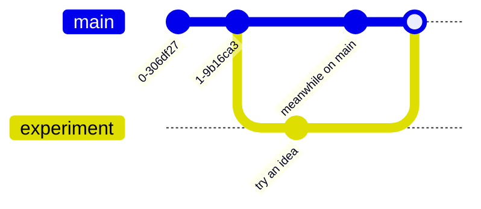

# Guide 2 - Practice the Git Loop *(warm-up)*

Before you touch your real portfolio, you'll rehearse everything on a no-stakes
**[Git Playground](  https://github.com/CyberLab-S617/s617-git-playground.git  )** repo. Nothing here counts - mistakes are the whole point. 
By the end you'll be comfortable with three things: the everyday loop, travelling back through history, and branching.

## First, the mental model

Think of your project as a row of **snapshots** on a timeline. Every time you *commit*,
Git saves a new snapshot and remembers the order. `HEAD` is just a pointer that says
**"you are here."**

```
   A ---- B ---- C ---- D        each letter = one commit (a saved snapshot)
oldest                newest
                        ^
                       HEAD  ("you are here")
```

Two powers come from this: you can **travel back** to look at any old snapshot, and you
can **branch** - start a parallel line of work without disturbing the main one. That's
Parts B and C. First, the loop.

---

# Part A - The everyday loop

> **Fork** (your own copy) -> **clone** (onto your machine) -> **edit** -> **commit**
> (save a snapshot) -> **push** (send it up) -> **pull request** (propose it back).

## A1 - Fork the Git Playground
Open the playground repo and click **Fork** (top right):
```
https://github.com/CyberLab-S617/s617-git-playground.git

```
You now have your own copy at `github.com/YOUR-USERNAME/s617-git-playground`.

> The playground repo with the **Fork** button highlighted.


## A2 - Clone your fork
```bash
git clone git@github.com:YOUR-USERNAME/s617-git-playground.git
cd s617-git-playground
```

> A successful clone in the terminal.


## A3 - Make a change and commit it
In the `practice/` folder, create a **new file** named after you - `practice/your-name.md` -
write a line, then save your first snapshot:
```bash
git config user.name "your-user-name"
git config user.email "yournumber+your-noreply-email@user.noreply.github.com"
touch practice/your-name.md
git add practice/your-name.md
git commit -m "Add my practice file"
```


## A4 - Push it up

Generate Github token
Click your profile picture in the upper-right corner -> Settings -> left sidebar, scroll down to the bottom and click Developer settings -> Expand Personal access tokens and select Tokens (classic) 

write a note
Under Select scopes, check the box for repo (this is the only requirement to authorize code pushes)
Click Generate token at the bottom of the page.


Copy the generated token immediately and save it in a safe place. It will disappear forever once you leave the page.


```bash
git push
```

> The `git push` output.


## A5 - Open a pull request
On your fork's page, click the **Compare & pull request** banner, add a title, and
**Create pull request**. You've *proposed* your change back - you can't push to the
original directly, which is exactly how real collaboration works.

> The "Create pull request" screen.


The other side on the main Gethub account will see it like that


After merging your name will be added as one of the Contributors.


------------

# Part B - Time travel: going back to an old commit

Git never forgets. You can revisit any past snapshot to see how things *used to* look,
then hop back to the present. First, let's make some history to travel through.

## B1 - Make a few commits
Edit `practice/your-name.md` three times, committing after each change:
```bash
# edit the file using any text editor...
git add practice/your-name.md
git commit -m "First change"
# edit again using any text editor...
git add practice/your-name.md
git commit -m "Second change"
# edit again using any text editor...
git add practice/your-name.md
git commit -m "Third change"
```


## B2 - Look at your history
```bash
git log --oneline
```
You'll see your snapshots, newest at the top, each with a short **hash** (its ID):
```
9f3c1a2 Third change      <-HEAD (you are here)
4b7e880 Second change
a1d0f5c First change
7c2ee01 Add my practice file
```

> The `git log --oneline` output.


## B3 - Travel back
Pick an older hash and check it out:
```bash
git checkout a1d0f5c      # use a real hash from YOUR log
```
Open your file - it's back to how it was at that point in time!

```
   A ---- B ---- C ---- D
   ^
  HEAD   <-you are now looking at the past (an old snapshot)
```

Git calls this a **"detached HEAD."** That sounds alarming but just means *"you're
looking at an old snapshot, not on a branch."* It's completely safe - you're only
looking. Just don't start committing here for now.

> The terminal after checkout, and your file showing its older contents.


## B4 - Return to the present
```bash
git switch main
```
```
   A ---- B ---- C ---- D
                        ^
                       HEAD   <-back to the newest snapshot
```
Everything's back. **You didn't lose anything** - travelling back to look never
destroys your work. That safety net is a big part of why Git is worth learning.


---

# Part C - Branching: work without breaking things

A **branch** is a parallel line of work. You can try an idea on a branch while `main` stays clean and safe - then **merge** it in when you want. This is how real teams work: nobody commits straight to `main`.

Here's what a branch looks like - an idea that splits off `main` and later you can merges it back:



## C1 - Create a branch and switch to it
```bash
git switch -c experiment      # create a new branch called "experiment" and move to it
```

## C2 - Make a change on the branch
Edit your file, then:
```bash
git add practice/your-name.md
git commit -m "Try an idea on a branch"
```

## C3 - See that main is untouched
```bash
git switch main
```
Open your file - **your branch change isn't here.** It's safely tucked away on
`experiment`, and `main` is exactly as you left it. That's the whole point of a branch.

> Your file on `main`, without the experiment change.


## C4 - Merge the branch in
Once you're happy with the experiment, bring it into `main`:
```bash
git merge experiment
```
Now your change is part of `main` too.

> The `git merge` output, and `git log --oneline` showing the merge.


---

 You've done everything you need for today:** the fork-to-PR loop, travelling back
through history, and branching. You'll use the loop for your portfolio and your first real pull request next - and branching becomes the backbone of how we collaborate later in the semester.
